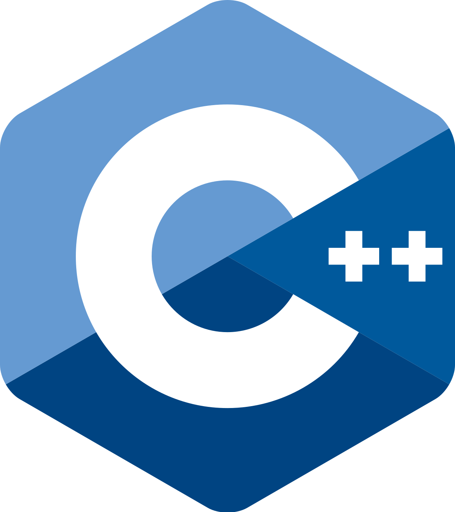
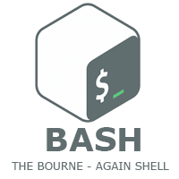
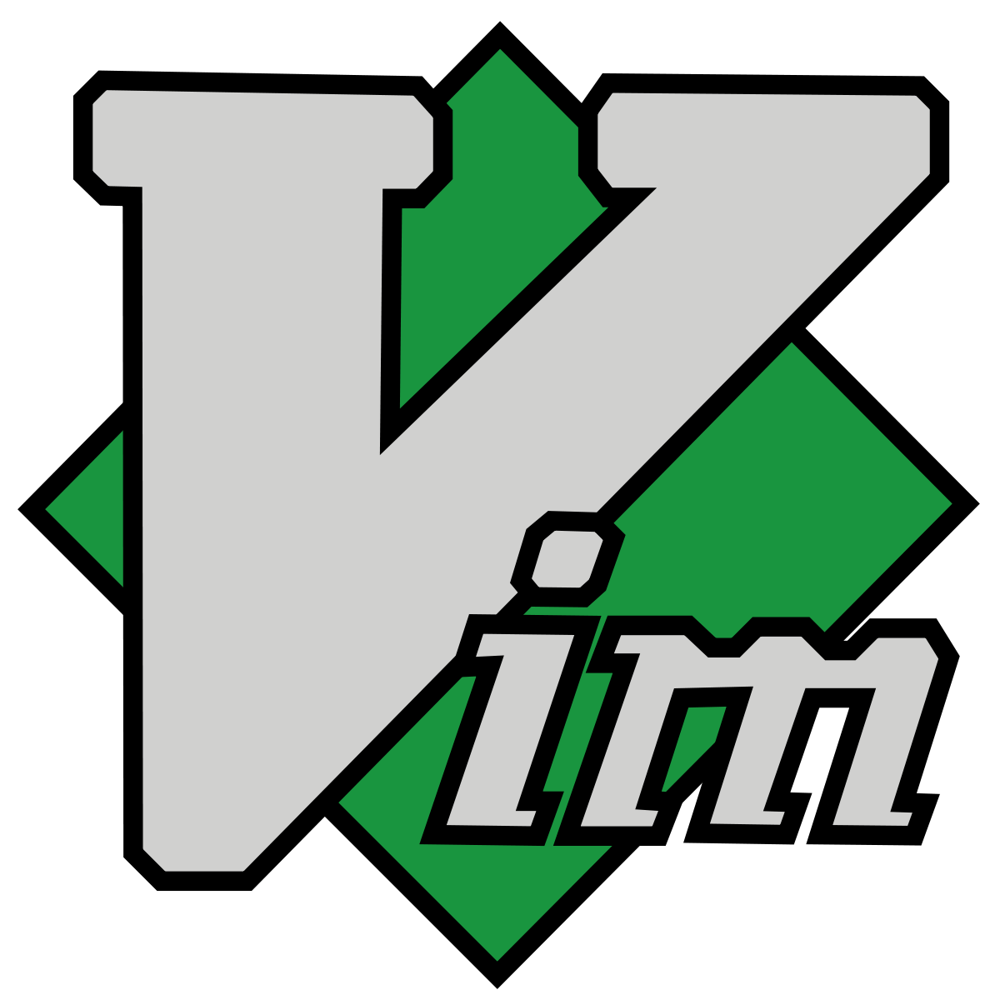
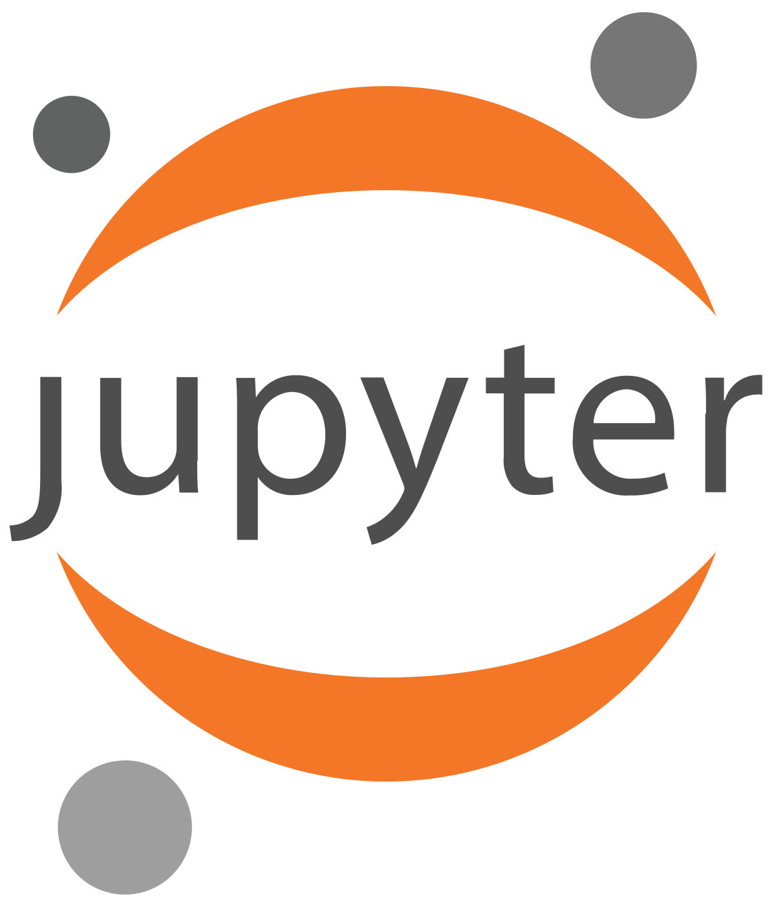
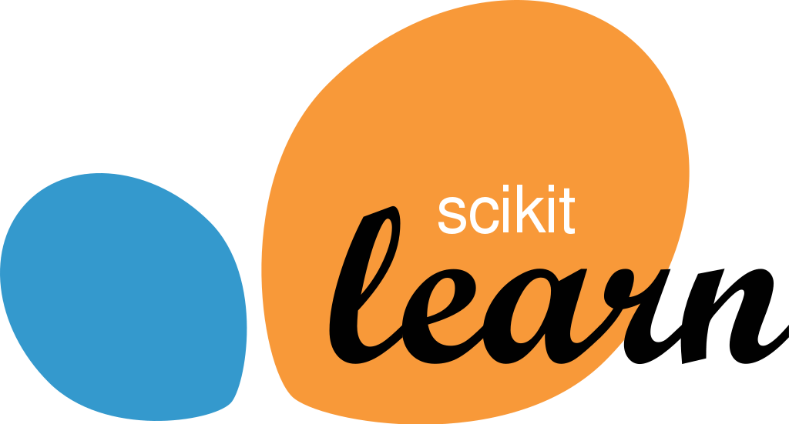

### Hi there 👋

I am MR or **Ray** from Arak, Iran. I'm a CE student, passionate about AI and security 💻 I'm an experienced python programmer for two years, DevOps enthusiastic And a fan of linux and open-source community 😃 I'm also interested in web developing with Django framework and React on my free times. I love anime and indie games 🎮 I usually listen to metal and rock music 🤘 And I recently started playing electric guitar 🎸

### Programming Languages 🌐

- Know/Using

|   |   |  |   |
|---|---|---|---|

- Learning

|   |
|---|

### Tools 🛠️

- Know/Using

|  |  |  |   |   | many more...
|---|---|---|---|---|---|

- Learning

|  | |  | many more...
|---|---|---|---|

### Other Accounts 📫

You can find and get touch with me on these accounts!

|  |  |  |
|---|---|---|

### Contact 📨

---
⭐️ Please give me a star if my github page could help you.

